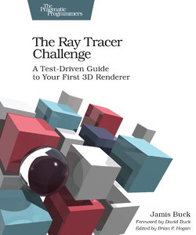
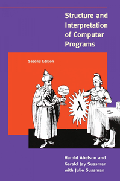
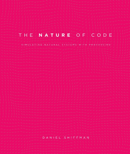
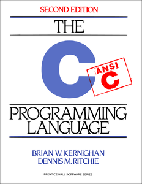
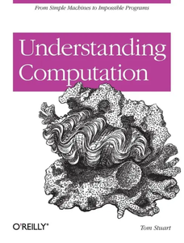
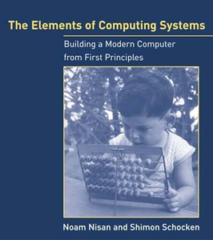

# Programming Praxis

This is a monorepo for all my programming practice projects. 

## Katas and Exercises

- [2024 Mars Rover Kata at Cambridge Software Crafters](./Events/2024-04-16-Mars-Rover-Kata/)
- [2023 Advent Of Code ](./Events/2023-Advent-Of-Code/)
- [2014 NHS hackday](./Events/2014-nhshackday/)
- [2013 NHS Hackday](./Events/2013-nhshackday/)
- [2013 Ludum Dare 26](./Events/2013-ludumdare-26/)
- [2012 Global Day of Code Retreat](./Events/2012-Global-Day-of-Code-Retreat/)
- [2012 Camgames hackathon](./Events/2012-01-Camgames-Hackday/)

## Books
| | Click on book | | 
| :---: | :---: | :---: |
|  |  |  |
|  |  |  |

